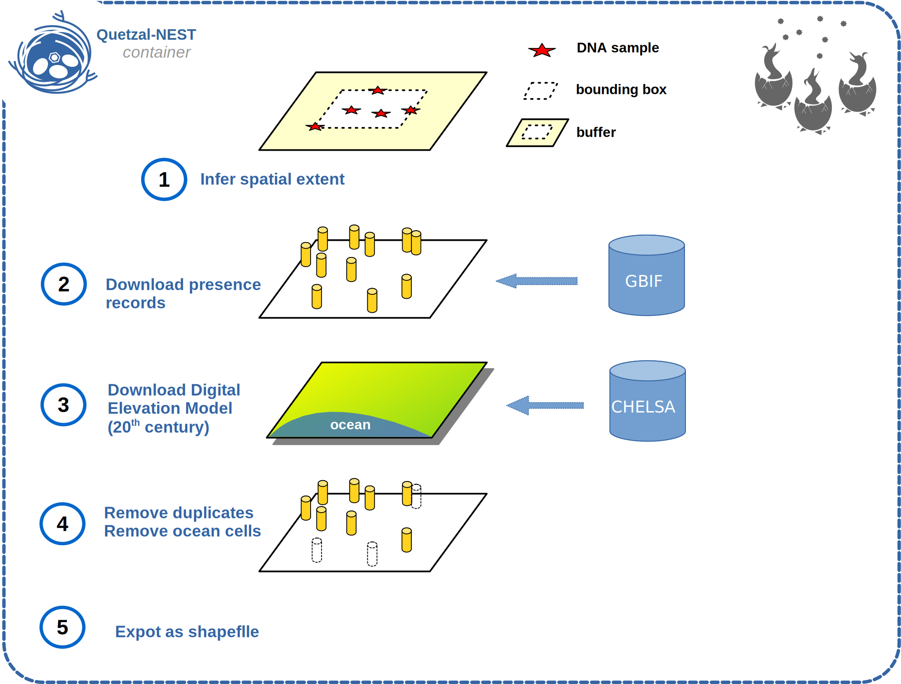

Accessing the GBIF database with Quetzal-CRUMBS
================================================

The `Global Biodiversity Information Facility <https://www.gbif.org/>`_ is an international network
and data infrastructure that provides open access to around 2 billions of occurrence
records.

Why do we need to access GBIF ?
-------------------------------

The first step in IDDC modeling is to reconstruct a dynamic suitability map to inform every
generation (or year, or century) of the simulation of a meta-population.
This suitability map can be derived from a Species Distribution Model
(aka an Environmental Niche Model).

There are many models available out there, and in CRUMBS we use a model averaging over 4 classifiers:

* Random Forest (RF)
* Extra-Tree (ET)
* Extreme Gradient Boosting (XGB)
* Light Gradient Boosted Machine (LGBM)

These classifiers use spatial predictors (bioclimatic variables from CHELSA) and the following features:

* presence points (*retrieved from the Global Biodiversity Information Facility*)
* pseudo-absence points (*generated from the presence points and the CHELSA Digital Elevation Model*).

Why a scripted approach?
------------------------

To integrate GBIF occurrence records in an IDDC workflow, you need to:

1. download the observational data
2. restrict them to your area of interest (a bounding box around your genetic sample +/- an offset in km)
3. remove the duplicated obsevations
4. download the CHELSA-TraCE21k Digital Elevation Model for the present century
5. filter out the data points that fall in the ocean cells
6. export the remaining points as a shapefile

You could do that manually, but for reproducible science it's nice to have these
steps configured in a script and executed programmatically: this is in essence
what the ``crumbs-get-gbif`` utility does.

   Effect of the ``crumbs-get-gbif`` command

Usage
-------

Context
^^^^^^^^^^^^^^^^^^^^^^^^^^^^^^^^^^^^^^^^^^^^

To run this command successfully, you will need to start with a set of longitude/latitude points.
That would normally be the coordinates of your DNA samples, but if you want to
reproduce our example then just download our test data points from Github:

1. Go to the `Download Directory <https://download-directory.github.io/>`_ utility
2. Enter this url: ``https://github.com/Becheler/quetzal-CRUMBS/tree/main/tests/data/test_points``
3. Press enter to start the download
4. Extract the archive in your working directory
5. You should find 3 files: move them to your Docker working directory

   * ``test_points.shp``
   * ``test_points.shx``
   * ``test_points.dbf``

Command
^^^^^^^^^^^^^^^^^^^^^^^^^^^^^^^^^^^^^^^^^^^^

You can then execute this command to retrieve 30 occurrences of *H. binoei* between 1950 and 2022
with a buffer of 2.0 degrees around the bounding box of the sampling points:

.. code-block:: bash

   crumbs-get-gbif \
         --species "Heteronotia binoei" \
         --points 'test_points.shp' \
         --limit 30 \
         --year "1950,2022" \
         --buffer 2.0 \
         --output occurrences

Output
^^^^^^^^^^^^^^^^^^^^^^^^^^^^^^^^^^^^^^^^^^^^

.. code-block::

    - Quetzal-CRUMBS - Global Biodiversity Information Facility (GBIF) wrapper for iDDC models
       ... Looking in GBIF database for Heteronotia binoei
       ... Search in the bounding box provided by tests/data/test_points/test_points.shp with buffer 2.0 degrees
       ... Bounding box used: POLYGON ((128.8515 -18.2625, 139.0335 -18.2625, 139.0335 -9.0333, 128.8515 -9.0333, 128.8515 -18.2625))
       ... For Heteronotia binoei GBIF suggested the taxon key: 2448146
       ... We identified 6591 available records in the bounding box.
       ... Option all is False, using the limit option to retrieve only the first 30 available records.
       ... 30 records retrieved.
