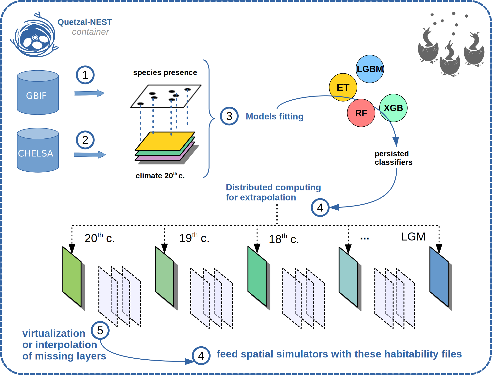

..
   Note: Items in this toctree form the top-level navigation. See `api.rst` for the `autosummary` directive, and for why `api.rst` isn't called directly.

.. toctree::
   :hidden:

   Home <self>
   Enter the Quetzal-NEST <nest>
   Get GBIF <gbif>
   Get CHELSA-TraCE21k <self>
   Fit a SDM <self>
   Extrapolate a SDM <self>
   Prepare the landscape <self>

   API reference <_autosummary/crumbs>

Welcome to Quetzal-CRUMBS
=====================================================

This python library is part of the Quetzal framework for iDDC modeling and inference.

IDDC modeling
------------

**iDDC modeling** (*integrated Distributional, Demographic, Coalescent modeling*) is a
methodology for statistical phylo-geography. It relies heavily on spatial models
and methods to explain how past processes (sea level change, glaciers dynamics,
climate modifications) shaped the present spatial distribution of genetic lineages.

.. figure:: quetzal_EGG2.gif
   :alt: Quetzal simulation
   :class: with-shadow
   :width: 400px
   :align: center

   Simulating the effect of climatic pulses on sky-islands populations with Quetzal.

* For a quick tour of the iDDC field, have a look at `my blog post. <https://becheler.github.io/who-am-i/>`_
* For a more formal presentation of the field, see this excellent review by
  `Dennis J. Larsson, Da Pan and Gerald M. Schneeweiss. <https://www.annualreviews.org/doi/abs/10.1146/annurev.ecolsys.38.091206.095702?journalCode=ecolsys>`_

The Quetzal framework
--------------------

To sustain the IDDC field, we develop the Quetzal suite:

* `Quetzal-CoaTL <https://becheler.github.io/softwares/quetzal-CoalTL/home/>`_ : an advanced C++ toolbox to build the Quetzal-EGGS simulators
* `Quetzal-EGGS <https://github.com/Becheler/quetzal-EGGS>`_ : spatially explicit coalescence-based C++ simulators of genetic diversity
* Quetzal-CRUMBS: this very Python library that produces EGGS inputs and digest their output
* `Quetzal-NEST <https://hub.docker.com/r/arnaudbecheler/quetzal-nest>`_ : a Docker container, a reproducible environment that contains all the Quetzal dependencies and allows to run simulations on clusters grids.

In other words, the Quetzal-CRUMBS library is meant to be a part of a bigger workflow.

.. figure:: pipeline_SOFTWARES.svg
   :alt: Quetzal framework
   :class: with-shadow
   :width: 600px

   How Quetzal-CRUMBS fit in the Quetzal framework.

CRUMBS features:
----------------

1. Access the Global Biodiversity Information Facility to retrieve presence points
2. Access the high resolution paleoclimatic database CHELSA to download world files
3. Fit a Species Distribution model and save (persist) the fitted models
4. Distribute the fitted models on cluster nodes and:
    * reconstruct landscape habitability dynamics across millennia
    * perform model averaging
    * fetch and assemble the layers
5. Prepare the dynamic landscape for simulation-based inference
    * adjust the landscape extent and its grid resolution
    * interpolate missing layers if you need to smooth sharp climatic transitions
    * virtualize missing layers if you need to save memory
    * Use the resulting ``landscape.vrt`` file to trick the simulator into believing a layer exists for each generation to simulate
6. Use Quetzal-EGGS spatial simulators, retrieve parameters and simulated genetic data from the output database
7. Use Decrypt to perform robustness analysis of species delimitation methods.

   Using Quetzal-CRUMBS to inform landscape simulations at phylogeographic scales
